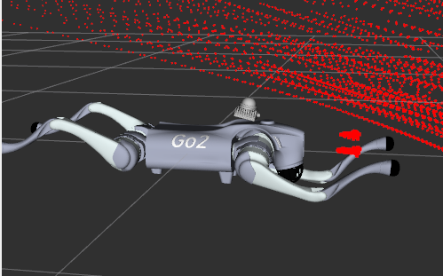

# Quadruped Robot Navigation in Gazebo

This repository integrates reinforcement learning (RL), navigation, and simulation to enable autonomous navigation for the Unitree Go2 and Go2W quadruped robots in Gazebo.

## Overview


This project follows a Sim-to-Sim approach, executing controllers trained in Isaac Lab within the Gazebo simulator. The virtual Unitree Go2 and Go2W robots are equipped with a Livox Mid-360 LiDAR. The mounting position of the LiDAR is based on the [Unitree developer documentation](https://support.unitree.com/home/en/developer/SLAM%20and%20Navigation_service).

## Prerequisites

Before you begin, ensure you have the following dependencies installed:

1.  **ROS 2 Humble:** Please follow the official installation instructions.

2.  **Livox SDK2:**
    ```bash
    git clone https://github.com/Livox-SDK/Livox-SDK2.git
    cd Livox-SDK2
    mkdir build && cd build
    cmake .. && make
    sudo make install
    ```

3.  **Required ROS 2 Packages:**
    ```bash
    sudo apt update && sudo apt install -y \
      ros-humble-teleop-twist-keyboard \
      ros-humble-ros2-control \
      ros-humble-ros2-controllers \
      ros-humble-control-toolbox \
      ros-humble-robot-state-publisher \
      ros-humble-joint-state-publisher-gui \
      ros-humble-gazebo-ros2-control \
      ros-humble-gazebo-ros-pkgs \
      ros-humble-xacro \
      ros-humble-navigation2 \
      ros-humble-octomap-ros\
      ros-humble-octomap-rviz-plugins\
    ```

4.  **LibTorch (C++):**
    ```bash
    # Choose a directory to store the library
    mkdir -p ~/libs && cd ~/libs
    wget https://download.pytorch.org/libtorch/cpu/libtorch-cxx11-abi-shared-with-deps-2.0.1%2Bcpu.zip
    unzip libtorch-cxx11-abi-shared-with-deps-2.0.1+cpu.zip
    rm libtorch-cxx11-abi-shared-with-deps-2.0.1+cpu.zip
    echo 'export Torch_DIR=$HOME/libs/libtorch' >> ~/.bashrc
    source ~/.bashrc
    ```

5.  **yaml-cpp and lcm:**
    ```bash
    sudo apt install -y liblcm-dev libyaml-cpp-dev
    ```

## Installation

1.  **Clone the Repository:**
    Create a ROS 2 workspace and clone this repository recursively.
    ```bash
    mkdir -p ~/ros2_ws/src && cd ~/ros2_ws/src
    git clone https://github.com/RCILab/RCI_quadruped_robot_navigation --recursive
    ```

2.  **Build the Workspace:**
    Install dependencies and build the packages.
    ```bash
    cd ~/ros2_ws
    colcon build --symlink-install
    ```

3.  **Source the Environment:**
    Source the workspace's setup file to make the packages available in your environment.
    ```bash
    echo "source ~/ros2_ws/install/setup.bash" >> ~/.bashrc
    source ~/.bashrc
    ```

## Usage

Follow these steps to launch the simulation and control the robot. Each command should be run in a new terminal.

1.  **Launch Gazebo & RViz2:**
    This command starts the Gazebo simulation with the robot model and launches RViz2 for visualization.
    *   Default robot is `go2`.
    *   Use the `rname` argument to switch to another robot like `go2w`.

    ```bash
    # Launch with the default Go2 robot
    ros2 launch rl_sar gazebo.launch.py

    # Launch with the Go2W robot
    ros2 launch rl_sar gazebo.launch.py rname:="go2w"
    ```

2.  **Run the RL Controller:**
    This node is responsible for the robot's locomotion control.
    ```bash
    ros2 run rl_sar rl_sim
    ```

3.  **Run the Action Client:**
    This client sends high-level commands or goals to the controller.
    ```bash
    ros2 run rl_action command
    ```

## Example: Teleoperation Control

This example demonstrates how to control the robot's movement using keyboard commands.

1.  **Activate the Robot:**
    In the terminal where you launched the `rl_action command` node, enter the following commands to activate the robot and enable navigation mode:
    ```bash
    (csuite) activation true
    (csuite) navigation true
    ```

2.  **Launch Keyboard Teleoperation:**
    Open a **new terminal** and run the `teleop_twist_keyboard` node to control the robot with your keyboard.
    ```bash
    ros2 run teleop_twist_keyboard teleop_twist_keyboard
    ```
    You can now move the robot using the capital keys displayed in the terminal (e.g., `U`, `I`, `O`, `J`, `K`, `L`, `M`, `<`, `>`)

3.  **Deactivate the Robot:**
    When you are finished, deactivate the robot and exit the command interface by returning to the `rl_action` terminal and entering:
    ```bash
    (csuite) activation false
    (csuite) quit
    ```
    
## TodoList 

1. **Navigation integration**  
   - Add navigation capability using either the `Nav2` package or by integrating with [unitree_go2_nav](https://github.com/Sayantani-Bhattacharya/unitree_go2_nav)

2. **OpenRMF support**  
   - Incorporate [Open-RMF](https://www.open-rmf.org/) functionality for fleet and task management

3. **Minor bug fixes**  
   - Verify and correct PCD positioning  
   -   
   - **Hot Fix!** To minimize distortion of the Livox Mid-360, set `min_range = 0`.  
     See the discussion here: [Livox-SDK/livox_laser_simulation#19](https://github.com/Livox-SDK/livox_laser_simulation/issues/19)


4. **RL model update**  
   - Modify reinforcement learning to account for LiDAR weight

## License

This project is licensed under the **MIT License**. See the [LICENSE](LICENSE) file for details.

In addition, the following components are based on forked repositories with modifications:

- Controller module is forked and adapted from [fan-ziqi/rl_sar](https://github.com/fan-ziqi/rl_sar)  
- Gazebo simulation for the Livox Mid-360 is forked and adapted from [LCAS/livox_laser_simulation_ros2](https://github.com/LCAS/livox_laser_simulation_ros2)

Each of these components follows the respective license of the original repository.


## Contact

**Maintainer:** Sanghyun Kim (`kim87@khu.ac.kr`)

**Lab:** [RCI Lab @ Kyung Hee University](https://rcilab.khu.ac.kr)
